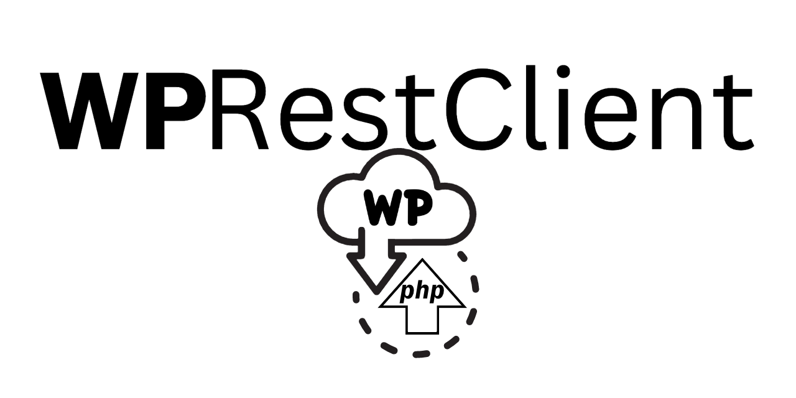

[](https://app.codacy.com/gh/angelxmoreno/WPRestClient/dashboard?utm_source=gh&utm_medium=referral&utm_content=&utm_campaign=Badge_grade)
[](https://codecov.io/gh/angelxmoreno/WPRestClient)
[](https://github.com/angelxmoreno/WPRestClient/blob/master/LICENSE)


[](https://GitHub.com/angelxmoreno/WPRestClient/graphs/commit-activity)


###<p style="text-align: center;">a PHP WordPress API Client</p>

WPRestClient is a PHP library for seamless interaction with WordPress sites via the WordPress RESTful API, simplifying
authentication, data retrieval, and content management tasks

## Features

- Connect to WordPress sites and authenticate using REST API authentication methods.
- Retrieve posts, pages, custom post types, categories, tags and other WordPress entities.
- Create, update and delete posts and pages.
- Perform advanced queries and filter responses using the power of the WordPress RESTful API.
- Use the [APIClient](https://wprestclient.readthedocs.io/en/latest/usage/client) for low level calls
- Use [Repositories](https://wprestclient.readthedocs.io/en/latest/usage/repositories) and gain WordPress entity objects
- [Configurable API Prefix](https://wprestclient.readthedocs.io/en/latest/extending/api-prefix)
- [Create custom entities](https://wprestclient.readthedocs.io/en/latest/extending/entity) or extend the existing ones
- [Create custom repositories](https://wprestclient.readthedocs.io/en/latest/extending/repository) for any endpoint

## Requirements

PHP 7.4+

## Installation

You can install WPRestClient via Composer. Run the following command in your project directory:

```bash
composer require angelxmoreno/wprestclient
```

## Usage

1. Create a new instance of the WPRestClient:

    ```php
    use WPRestClient\Core\ApiClient;
    
    $client = new ApiClient('https://example.com');
    ```

2. Retrieve a raw array of posts via the client:

    ```php
    $posts = $client->sendRequest('get','/posts');
    foreach ($posts as $post) {
        echo $post['title']['rendered'];
    }
    ```

3. Retrieve an array `PostEntity` objects via the `PostsRepository`:

    ```php
   use WPRestClient\Repository\PostsRepositor;
   
   PostsRepository::setApiClient($client);
   $posts = PostsRepository::fetch();
   foreach ($posts as $post) {
       echo $post->getTitle();
   }
    ```

4. Create a new Page via the `PagesRepository` using the `RepositoryRegistry`:
   By creating an instance of `RepositoryRegistry`, you have access to all the registered repositories with
   the `ApiClient` already set.

    ```php
   use WPRestClient\Repository\PagesRepository;
   use WPRestClient\Core\RepositoryRegistry;
   use WPRestClient\Entity\PageEntity;
   
   $registry = new RepositoryRegistry($client);
   $page = new PageEntity(['title' => 'A New Page']);
   $registry->pages()->create($page);
    ```   

5. Delete a post via the `PostsRepository` using the `RepositoryRegistry`:

    ```php
   use WPRestClient\Repository\PagesRepository;
   use WPRestClient\Core\RepositoryRegistry;
   use WPRestClient\Entity\PageEntity;
   
   $registry = new RepositoryRegistry($client);
   $post = $registry->posts()->get(123);
   $registry->posts()->delete($post);
    ```

For more detailed usage examples and available methods, please refer to
the [documentation](https://wprestclient.readthedocs.io/en/latest/).

## Contribution

Contributions are welcome! If you find a bug, have suggestions for improvements, or would like to add new features,
please submit an issue or a pull request. Make sure to follow
our [contribution guidelines](https://wprestclient.readthedocs.io/en/latest/contributing/)

## License

WPRestClient is open-source software licensed under the [MIT license](LICENSE)

## Contact

For any questions or inquiries, please contact [WPRestClient@gmail.com](mailto:WPRestClient@gmail.com)

## Support

For bugs and feature requests, please use the [issues](https://github.com/angelxmoreno/WPRestClient/issues) section of
this repository.

