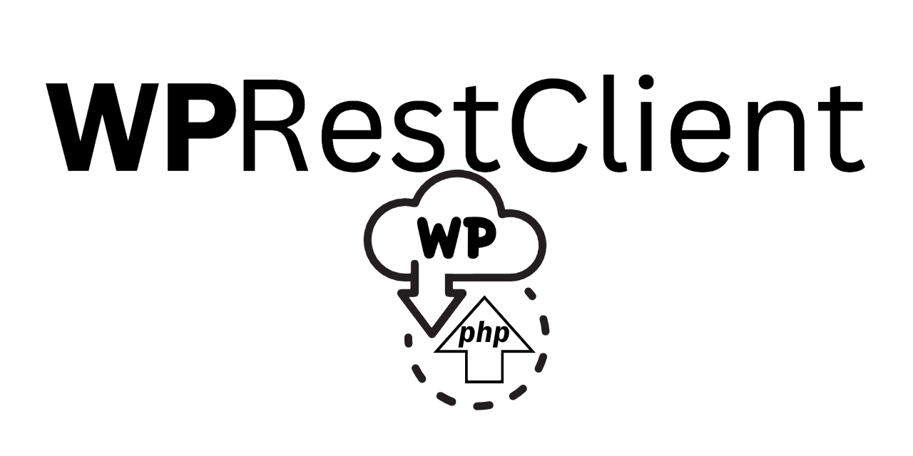

###
a PHP WordPress API Client

WPRestClient is a PHP library for seamless interaction with WordPress sites via the WordPress RESTful API, simplifying
authentication, data retrieval, and content management tasks

## Features

- Connect to WordPress sites and authenticate using REST API authentication methods.
- Retrieve posts, pages, custom post types, categories, tags and other WordPress entities.
- Get [paginated results](usage/repositories.md#repositoryfetchpaginated) of WordPress entities
- Create, update and delete posts and pages.
- Perform advanced queries and filter responses using the power of the WordPress RESTful API.
- Use the [APIClient](usage/client.md) for low level calls
- Use [Repositories](usage/repositories.md) and gain WordPress entity objects
- [Configurable API Prefix](extending/api-prefix.md)
- [Create custom entities](extending/entity.md) or extend the existing ones
- [Create custom repositories](extending/repository.md) for any endpoint

## Installation

View our [Installation instructions](installation.md)

## Quickstart

Get started by following along our [Quickstart Guide](quickstart.md)

## Usage Examples

- [Using Repositories](usage/repositories.md)
- [Using the API Client](usage/client.md)

## Contributing

Follow our [Contribution Guidelines](contributing.md)