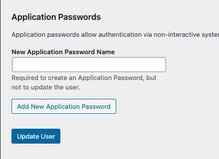

# WordPress Application Passwords

## What are Application Passwords

WordPress Application Passwords are a valuable feature that enhances the security of your website while simplifying the
process of connecting third-party services. Available for WordPress sites running version 5.6 or higher, Application
Passwords empower users to generate unique and dedicated passwords specifically for integrating external applications.

By implementing Application Passwords, WordPress provides an additional layer of security by ensuring that users don't
need to share their main account credentials with external services. This means that even if one of the application
passwords is compromised, the potential impact is limited to that specific service or application. It greatly reduces
the risk of unauthorized access to the main account and safeguards sensitive data.

Generating application passwords is a straightforward process, conveniently accessible from the Edit Profile screen.
Users can easily create and manage their application passwords without the need for complex configurations or external
plugins. This built-in functionality streamlines the integration of third-party services and allows users to maintain
granular control over the permissions granted to each application.

With WordPress Application Passwords, website owners and administrators can confidently expand the functionality of
their sites by seamlessly connecting with trusted external services, such as mobile apps, plugins, or custom-developed
applications. The simplified process ensures a smoother user experience and encourages secure and efficient
integrations, reinforcing the overall security posture of WordPress-powered websites.

## Application Password Format

Application Passwords are 24 characters in length and generated using the wp_generate_password() function. These
passwords do not contain special characters and consist only of uppercase letters, lowercase letters, and numbers. This
combination provides over 142 bits of entropy, making them cryptographically secure.

When presented to users for input in an application, the passwords are chunked and displayed in an easily readable
format, like this:

```text
abcd EFGH 1234 ijkl MNOP 6789
```

Users can choose to include or exclude the spaces when entering the password into an application. If spaces are
included, they will be stripped out before the password is hashed and verified.

!!! note

    For more information take a look at the artile [Application Passwords: Integration Guide](https://make.wordpress.org/core/2020/11/05/application-passwords-integration-guide/)

# How to Generate Application Passwords in WordPress

1. Log in to your WordPress site with an admin user account  
   

2. Navigate to Users > Profile.  
   

3. Navigate to the section labeled as "Application Passwords" further down the page.
   

4. In the "New Application Password Name" field, provide a meaningful description for your application password. This
   field is intended for internal reference only and assists in identifying the purpose or association of your
   application password.  
   

5. To generate your password, click on the "Add New Application Password" button. Remember to promptly copy and securely
   store your password in a safe location, as application passwords cannot be recovered once you leave this screen. It
   is strongly recommended to generate a separate application password for each app you connect with to maintain optimal
   security.
   